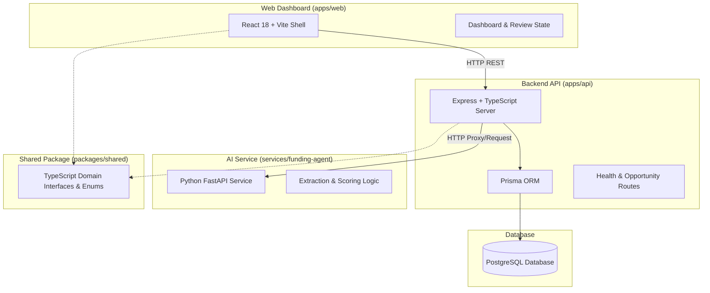

# Bridge AI — Architecture Specification

## System Overview

Bridge AI is designed using a **clean monorepo architecture** that isolates domain concerns, separates service boundaries, and maintains strict typing across web interfaces, backend API services, AI extraction agents, and shared domain models.



---

## Service Boundaries

### 1. `apps/web` (Frontend Shell)
- **Tech Stack**: React 18, TypeScript, Vite, Vanilla CSS design system.
- **Responsibilities**: Human-in-the-loop review dashboard, fit score visualizer, organization profile view, and health monitor.

### 2. `apps/api` (Core Gateway & REST API)
- **Tech Stack**: Node.js, TypeScript, Express, Prisma ORM.
- **Responsibilities**: REST API routing, database transactions, human approval auditing, data persistence, and orchestration with Python services.

### 3. `services/funding-agent` (Python Funding Intelligence Agent)
- **Tech Stack**: Python 3.10+, FastAPI, Pydantic.
- **Responsibilities**: Text processing, eligibility parsing engine, participant support extraction, provenance citation binding, and fit scoring calculations.

### 4. `packages/shared` (Shared Domain Contracts)
- **Tech Stack**: TypeScript (ESM/CJS compiled).
- **Responsibilities**: Canonical entity contracts, enum definitions (`EligibilityStatus`, `ParticipantSupportCategory`), and fit score calculation interfaces shared between `web` and `api`.

---

## Data Provenance & Citation Model

Every extracted fact stored in Bridge AI adheres to strict provenance standards:

```typescript
interface SourceCitation {
  id: string;
  opportunityId: string;
  sourceUrl: string;
  sourceTitle?: string;
  sourceOrganization?: string;
  verificationDate: string;
  quotedSection?: string;
  extractedClaim: string;
}
```

No claim may exist in the system without an associated citation or an explicit tag designating it as `AI_GENERATED_DRAFT` requiring human verification.

---

## Phase 1A Architecture — Database Persistence & Read APIs

```
[ HTTP GET /api/opportunities ]
               │
               ▼
   [ Opportunity Router ]  ── (Validates query params: status, minimumFitScore, limit, page)
               │
               ▼
   [ Opportunity Service ] ── (Executes Prisma relation queries with pagination)
               │
               ▼
   [ Singleton Prisma Client ]
               │
               ▼
   [ PostgreSQL Database ] ── (Holds seeded DEMO fixtures & migration 20260812003912_init_phase1a)
```

### 1. Prisma Persistence Layer
- **Singleton Management**: Singleton instance in `apps/api/src/lib/prisma.ts` attached to `globalThis` in development to prevent hot-reload connection leaks, handling disconnect gracefully on `SIGINT` / `SIGTERM`.
- **Database Schema**: Managed via Prisma migrations (`prisma/migrations/20260812003912_init_phase1a/migration.sql`), enforcing relational integrity across opportunities, sources, requirements, allowable costs, scoring criteria, participant support matrices, and citations.

### 2. Service / Repository Boundary
- `OpportunityService` (`apps/api/src/services/opportunityService.ts`) encapsulates all database interaction logic, query construction, filtering (`status`, `fundingType`, `minimumFitScore`), and pagination metadata generation.
- Express route handlers delegate directly to `OpportunityService`, keeping HTTP transport concerns separate from data persistence.

### 3. Read-Only Opportunity API
- **`GET /api/opportunities`**: Returns paginated opportunity summaries including latest fit score analysis. Rejects invalid or unexpected query parameters with HTTP 400.
- **`GET /api/opportunities/:id`**: Returns complete relation graph for deep review. Returns structured HTTP 404 error payload for non-existent IDs.

### 4. Fixture-Versus-Verified Data Distinction
- All synthetic demonstration records carry `isDemo: true` in the database schema and explicit `[DEMO]` prefix in titles.
- Provenance citations for demo records explicitly state their synthetic nature.
- The API and React UI enforce visual distinction (`DEMO FIXTURE` badges) so demonstration data is never blurred with future verified live opportunities.

