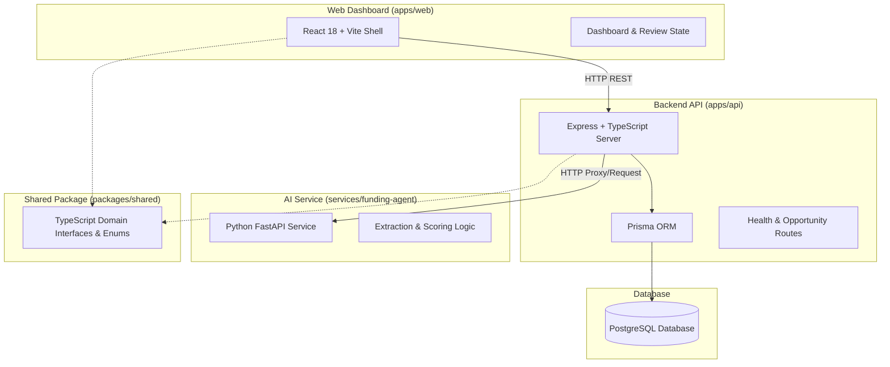

# Bridge AI — Architecture Specification

## System Overview

Bridge AI is designed using a **clean monorepo architecture** that isolates domain concerns, separates service boundaries, and maintains strict typing across web interfaces, backend API services, AI extraction agents, and shared domain models.



---

## Service Boundaries

### 1. `apps/web` (Frontend Shell)
- **Tech Stack**: React 18, TypeScript, Vite, Vanilla CSS design system.
- **Responsibilities**: Human-in-the-loop review dashboard, fit score visualizer, organization profile view, and health monitor.

### 2. `apps/api` (Core Gateway & REST API)
- **Tech Stack**: Node.js, TypeScript, Express, Prisma ORM.
- **Responsibilities**: REST API routing, database transactions, human approval auditing, data persistence, and orchestration with Python services.

### 3. `services/funding-agent` (Python Funding Intelligence Agent)
- **Tech Stack**: Python 3.10+, FastAPI, Pydantic.
- **Responsibilities**: Text processing, eligibility parsing engine, participant support extraction, provenance citation binding, and fit scoring calculations.

### 4. `packages/shared` (Shared Domain Contracts)
- **Tech Stack**: TypeScript (ESM/CJS compiled).
- **Responsibilities**: Canonical entity contracts, enum definitions (`EligibilityStatus`, `ParticipantSupportCategory`), and fit score calculation interfaces shared between `web` and `api`.

---

## Data Provenance & Citation Model

Every extracted fact stored in Bridge AI adheres to strict provenance standards:

```typescript
interface SourceCitation {
  id: string;
  opportunityId: string;
  sourceUrl: string;
  sourceTitle?: string;
  sourceOrganization?: string;
  verificationDate: string;
  quotedSection?: string;
  extractedClaim: string;
}
```

No claim may exist in the system without an associated citation or an explicit tag designating it as `AI_GENERATED_DRAFT` requiring human verification.

---

## Security & Environment Integrity

- Secrets and environment-specific configs are managed strictly through standard environment variables (`.env`).
- Database credentials and API keys are strictly excluded from source repositories (`.gitignore`).
- All API endpoints strictly audit human review actions (`humanReviewedAt`, `humanReviewedBy`).
